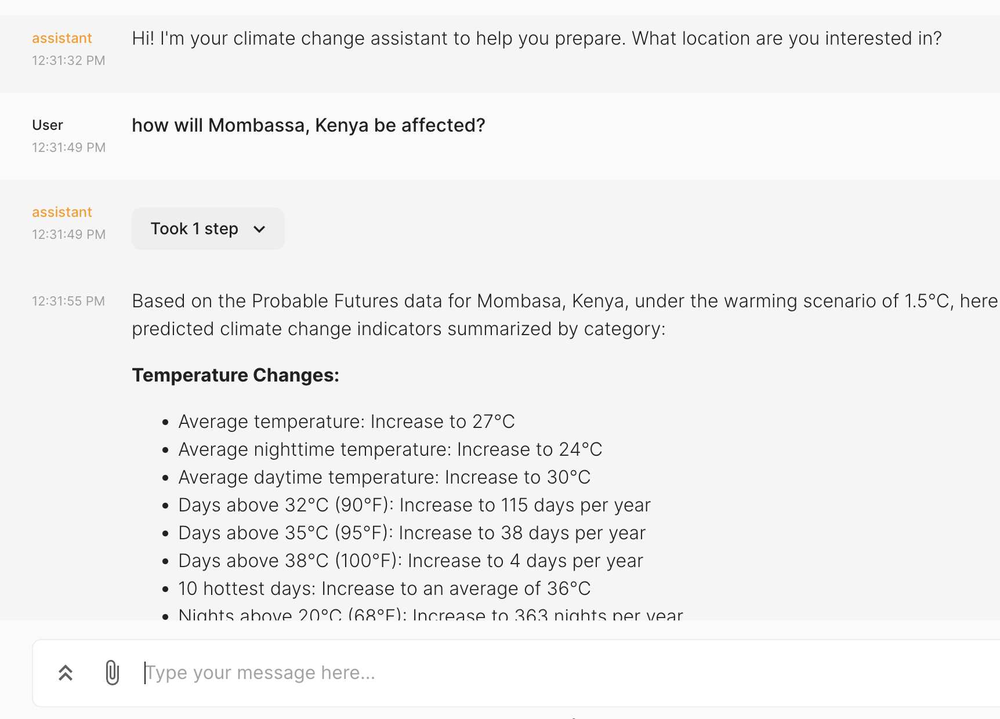

# @probable-futures/climate-change-assistant

This project was created by [Matthew Harris](https://www.linkedin.com/in/matthew-harris-4018865) at [DataKind](https://www.datakind.org/) using the [Probable Futures open data resources](https://probablefutures.org/open-data/). Matthew published [a blog post about creating this project](https://towardsdatascience.com/preparing-for-climate-change-with-an-ai-assistant-cdceb5ce4426) which contains extensive detail about his approach. This repository is a fork of [Matthew's original repository](https://github.com/datakind/climate-change-assistant) and is not owned by Probable Futures, but rather is an experimental open source project that anyone is welcome to experiment with under Matthew's original terms. 

> [!CAUTION]
> This application is an experiment. Do not use it in publicly accessible applications. It should be used for experimental and research purposes only. 

If you are looking for climate change data that is ready for public use, please see the [Probable Futures climate handbook](https://probablefutures.org/stability/), [climate maps](https://probablefutures.org/maps/), and [open data resources](https://probablefutures.org/open-data/). To learn more about Probable Futures, please visit the [Probable Futures website](https://probablefutures.org/). 

## About the app
This chainlit app will use an [OpenAI Assistant](https://platform.openai.com/docs/assistants/overview) and the [Probable futures](https://probablefutures.org/) API to provide climate change information for a location, and provide some helpful resources for how to prepare. 

The chainlit app is based off the cookbook example [here](https://github.com/Chainlit/cookbook/tree/main/openai-assistant).

## Setup

You will need a probable future API key, see [here](https://docs.probablefutures.org/api-access/) for more details. You will also need an [OPENAI key](https://platform.openai.com/docs/quickstart?context=python).

Setup a Conda environment ...

1. Install [miniconda](https://docs.conda.io/en/latest/miniconda.html) by selecting the installer that fits your OS version. Once it is installed you may have to restart your terminal (closing your terminal and opening again)
2. `cd app/`
3. `conda env create -f environment.yml`
4. `conda init zsh` "zsh" can be replaced with your shell configuration
5. `conda activate assistant-env` (You can leave the environment by using `conda deactivate`)

If you add a new dependency, run `conda env update -f environment.yml` to install it or to update existing ones.

Once you have these, then ...

1. Copy `.env.example` to `.env`
2. Set OpenAI key and Probable Futures API user and secret
3. Create assistant with `python3 create_assistant.py` (If you have "ASSISTANT_ID" valid in `.env` you'll be updating that assistant)
4. Copy the assistant id from output and put into `.env`

If you make changes to the assistant, rerun `create_assistant.py`, which will update the existing assistant.
To create a new assistant, your "ASSISTANT_ID" in `.env` needs to be empty

## To run chainlit app

`chainlit run app.py`

## Run the app locally using docker (optional)

1. Build the docker image `docker build -t pf-assistant:latest .`
2. Run the app locally `docker run -p 8080:8080 pf-assistant:latest`

## To view assistant on OpenAI

Go [here](https://platform.openai.com/assistants)
